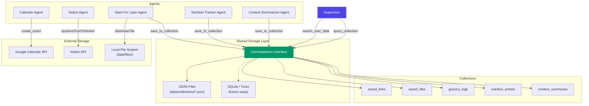

# ByteBeingsBot — Multi-Agent Build Plan

## Milestones Overview

Each milestone ends with a **manually testable checkpoint**. Don't proceed until you've verified the current milestone works.

```
M1  Core Types & Session Manager         (no behavioral change, app still builds)
M2  Agent Registry                       (no behavioral change, app still builds)
M3  BaseAgent + Tool-Calling Engine      (testable via unit tests)
M4  Notion Agent (migration)             (testable via unit tests)
M5  Pending Approval Store               (bridges WebApp UI to new agent system)
M6  Supervisor Agent                     (testable via unit tests)
M7  Telegram Rewrite — The Big Switch    (full E2E on Telegram)
M8  Session Lifecycle & History          (session summaries, /done, timeout)
M9  Cleanup & Documentation             (archive old files, update README)
```

---

## Preserved Components (DO NOT DELETE)

These existing files are reused as-is or with minimal adaptation:

| File | Status | Notes |
|------|--------|-------|
| `lib/notion.ts` | **KEEP** unchanged | Used by Notion Agent tools |
| `app/api/telegram/route.ts` | **KEEP** unchanged | Webhook handler |
| `app/table/page.tsx` | **MODIFY** (M5) | Change data source from LangGraph → PendingApprovalStore |
| `app/table/ApproveButton.tsx` | **KEEP** unchanged | Form POST to `/api/approve` |
| `app/api/approve/route.ts` | **MODIFY** (M5) | Change from LangGraph state → PendingApprovalStore |
| Telegraf bot instance | **KEEP** | Same `bot` object, new handlers |
| Inline keyboards | **KEEP** pattern | Approve/Retry buttons reused in Notion Agent response formatting |
| WebApp popup | **KEEP** | `Markup.button.webApp(...)` still used to open table view |

---

## M1 — Core Types & Session Manager

### Goal
Build the foundational type system and session management. The existing app continues to work — nothing is wired up yet.

### Files to Create

#### `lib/types.ts` — REWRITE

Replace the current 8-line file with the full agent system types. Include backward-compat exports at the bottom so existing code still compiles during migration.

```typescript
// New types (full list in implementation_plan.md Section 2):
// - AgentTool, AgentManifest, AgentContext, AgentResponse, IAgent
// - SessionMessage, Session, SessionSummary
// - DelegationResult, DirectResponse, SupervisorResult
// - PendingApproval (NEW — see M5)

// Backward compat (keep until M7):
export type WorkflowType = 'meeting_tasks' | 'prd_generator' | 'grocery_list';
export interface ProcessedOutput {
  summary: string;
  rows: Record<string, any>[];
  confidence: number;
}
```

**Critical**: The `PendingApproval` type must be defined here (used by M5):

```typescript
/**
 * Data stored when an agent wants to show the WebApp approval table.
 * Keyed by threadId. Read by /table page and /api/approve route.
 */
export interface PendingApproval {
  threadId: string;
  agentId: string;
  extractedData: {
    summary: string;
    rows: Record<string, any>[];
    confidence: number;
  };
  notionSchema: Record<string, any>;
  notionDatabaseId: string;
  createdAt: number;
}
```

#### `lib/session.ts` — NEW

Full SessionManager implementation (see implementation_plan.md Section 3.2):
- `getOrCreateSession(chatId)` → creates or returns session
- `addMessage(chatId, role, content, agentId?)` → appends to history
- `setActiveAgent(chatId, agentId | null)` → for follow-up routing
- `recordAgentUsage(chatId, agentId, taskSummary, success)` → for summaries
- `completeSession(chatId, outcome, summaryText)` → persist + clear
- `getSessionHistory(chatId, limit)` → read past summaries from disk
- Singleton with hot-reload safety (`global as unknown as ...`)
- Session data persists to `data/session_history/` on completion

### Files NOT Touched
Everything else stays exactly as-is. The old `lib/state.ts`, `lib/graph.ts`, `lib/workflows.ts` remain functional.

### How to Test (M1)

```bash
# 1. App still builds
npm run build

# 2. Unit tests (create __tests__/session.test.ts)
# Test cases:
#   - getOrCreateSession creates new session with correct shape
#   - getOrCreateSession returns existing session for same chatId
#   - addMessage appends to session.messages with correct fields
#   - setActiveAgent updates session.activeAgentId
#   - completeSession persists JSON file to data/session_history/
#   - completeSession clears the in-memory session
#   - getSessionHistory reads persisted files
npm run test

# 3. Existing bot still works on Telegram (no behavioral changes)
npm run dev
# Send /start to bot → should show old 3-button menu
# Run a workflow → should still work end-to-end
```

### Definition of Done
- [ ] `lib/types.ts` rewritten with all new types + backward compat
- [ ] `lib/session.ts` created with SessionManager
- [ ] `data/session_history/.gitkeep` created, `data/` added to `.gitignore`
- [ ] `npm run build` passes
- [ ] Session unit tests pass
- [ ] Existing Telegram bot still works (manual check)

---

## M2 — Agent Registry

### Goal
Build the registry that agents register with and the Supervisor queries.

### Files to Create

#### `lib/registry.ts` — NEW

Full AgentRegistry implementation (see implementation_plan.md Section 4.3):
- `register(agent)` → validates + stores
- `unregister(agentId)` → removes
- `getAgent(agentId)` → lookup
- `getAllManifests()` → for Supervisor context
- `getAllAgentIds()` → for Supervisor tool enum
- `generateSupervisorContext()` → auto-builds routing prompt text
- Singleton with hot-reload safety

### How to Test (M2)

```bash
# Unit tests (__tests__/registry.test.ts)
# Test cases:
#   - register() stores agent, getAgent() retrieves it
#   - register() rejects duplicate IDs
#   - unregister() removes agent
#   - getAllManifests() returns all registered manifests
#   - generateSupervisorContext() produces correct formatted text
#   - generateSupervisorContext() returns "no agents" message when empty
#   - Warns on missing required env vars (console.warn spy)
npm run test

# App still builds, bot still works
npm run build
```

### Definition of Done
- [ ] `lib/registry.ts` created
- [ ] Registry unit tests pass
- [ ] `npm run build` passes

---

## M3 — BaseAgent + Tool-Calling Engine

### Goal
Build the abstract base class that all agents extend. This contains the core Gemini tool-calling loop.

### Files to Create

#### `agents/base.ts` — NEW

Full BaseAgent implementation (see implementation_plan.md Section 4.2):
- Abstract: `manifest`, `tools`, `getSystemPrompt()`
- `execute(context)` — the tool-calling loop:
  1. Convert session history → Gemini `Content[]`
  2. Build `functionDeclarations` from agent's tools + built-in tools
  3. Call `ai.models.generateContent()` with tools config
  4. If `response.functionCalls` → execute tool → feed result back → loop
  5. Intercept `respond_to_user` → return final `AgentResponse`
  6. Intercept `request_followup` → return follow-up `AgentResponse`
  7. Safety: max 10 iterations
- `buildGeminiHistory(context)` — converts `SessionMessage[]` to `Content[]`
- Built-in tools injected into every agent:
  - `respond_to_user(message, success)` — signals task completion
  - `request_followup(question)` — asks user for more info

#### `lib/gemini.ts` — MODIFY

**Add** the `generateSessionSummary()` function (used in M8).
**Keep** everything else for now (existing `processWorkflow` still used until M7).

```typescript
// ADD this function:
export async function generateSessionSummary(
  messages: SessionMessage[]
): Promise<string> { /* ... */ }
```

### How to Test (M3)

```bash
# Unit tests (__tests__/base-agent.test.ts)
# Create a TestAgent extending BaseAgent with a mock tool.
# Mock ai.models.generateContent to return:
#   1. A function call → verify tool.execute() is called → verify result fed back
#   2. A respond_to_user call → verify AgentResponse returned correctly
#   3. A request_followup call → verify requiresFollowUp = true
#   4. Plain text (no function calls) → verify text returned as message
#   5. 11+ iterations → verify max iteration safety
npm run test

# App still builds, bot still works
npm run build
```

### Definition of Done
- [ ] `agents/base.ts` created
- [ ] `lib/gemini.ts` has `generateSessionSummary()` added
- [ ] BaseAgent unit tests pass with mocked Gemini
- [ ] `npm run build` passes

---

## M4 — Notion Agent (Migration)

### Goal
Migrate the 3 existing workflows into a single Notion Agent that uses the BaseAgent tool-calling loop.

### Files to Create

#### `agents/notion/index.ts` — NEW

NotionAgent extending BaseAgent (see implementation_plan.md Section 8.1):

**Manifest:**
- id: `'notion_agent'`
- Trigger examples cover meeting tasks, PRDs, grocery lists
- Required env vars: `NOTION_API_KEY`, `NOTION_DATABASE_ID`

**Tools (wrapping existing `lib/notion.ts` functions):**

| Tool Name | Description | Calls |
|-----------|-------------|-------|
| `get_notion_schema` | Fetch DB column schema | `getDatabaseSchema()` from `lib/notion.ts` |
| `push_rows_to_notion` | Push extracted rows to DB | `dynamicPushToNotion()` from `lib/notion.ts` |
| `store_pending_approval` | Store data for WebApp table approval (M5 bridge) | Writes to `PendingApprovalStore` |

**System Prompt:**
Instructs the LLM to:
1. Fetch schema first
2. Extract structured rows from user text
3. Store for approval via `store_pending_approval` (so the WebApp table works)
4. OR use `respond_to_user` with a text preview for simple cases

**Key decision: How approval works in the new system**

The Notion Agent has a `store_pending_approval` tool. When called:
1. It stores the extracted data in the `PendingApprovalStore` (M5)
2. Returns a result telling the agent the data is stored
3. The agent then calls `respond_to_user` with a message that includes the WebApp button URL

This bridges the existing WebApp table popup to the new agent system.

### How to Test (M4)

```bash
# Unit tests (__tests__/notion-agent.test.ts)
# Mock Gemini to simulate the tool-calling flow:
#   1. Agent calls get_notion_schema → receives schema
#   2. Agent calls store_pending_approval → data stored
#   3. Agent calls respond_to_user → returns message with approval info
# Also test:
#   - Agent calls request_followup when input is ambiguous
#   - push_rows_to_notion tool works with mocked notion.ts
npm run test

# App still builds, bot still works (old system untouched)
npm run build
```

### Definition of Done
- [ ] `agents/notion/index.ts` created
- [ ] Notion Agent unit tests pass
- [ ] `npm run build` passes

---

## M5 — Pending Approval Store + WebApp Bridge

### Goal
Create the data bridge between the new agent system and the existing WebApp table/approve UI. This replaces LangGraph state as the data source for the table page and approve route.

### Files to Create

#### `lib/approval-store.ts` — NEW

Simple in-memory store keyed by `threadId`:

```typescript
class PendingApprovalStore {
  private store: Map<string, PendingApproval> = new Map();

  set(threadId: string, data: PendingApproval): void;
  get(threadId: string): PendingApproval | undefined;
  delete(threadId: string): void;
  has(threadId: string): boolean;
}

// Singleton with hot-reload safety
export const approvalStore: PendingApprovalStore;
```

### Files to Modify

#### `app/table/page.tsx` — MODIFY

Change the data source from LangGraph state to PendingApprovalStore:

```diff
- import { workflowGraph } from '@/lib/graph';
+ import { approvalStore } from '@/lib/approval-store';

  // OLD:
- const state = await workflowGraph.getState({...});
- const { extractedData, workflowType, notionSchema } = state.values;

  // NEW:
+ const approval = approvalStore.get(threadId);
+ if (!approval) { /* show "No data found" */ }
+ const { extractedData, notionSchema } = approval;
+ const { summary, confidence } = extractedData;
```

Everything else stays: the table rendering, columns, rows, ApproveButton — all identical.

#### `app/api/approve/route.ts` — MODIFY

Change from LangGraph resume to direct Notion push:

```diff
- import { workflowGraph } from '@/lib/graph';
- import { clearSession } from '@/lib/state';
+ import { approvalStore } from '@/lib/approval-store';
+ import { dynamicPushToNotion } from '@/lib/notion';
+ import { sessionManager } from '@/lib/session';

  // OLD:
- const state = await workflowGraph.getState({...});
- await workflowGraph.updateState({...}, { approved: true });
- await workflowGraph.invoke(null, {...});

  // NEW:
+ const approval = approvalStore.get(threadId);
+ if (!approval) { /* 404 */ }
+ await dynamicPushToNotion(approval.notionDatabaseId, approval.extractedData.rows, approval.notionSchema);
+ approvalStore.delete(threadId);
```

Keep everything else: form handling, HTML success page, Telegram WebApp close script, bot.telegram.sendMessage confirmation — all identical.

#### `app/table/ApproveButton.tsx` — NO CHANGES

Stays exactly as-is. It POSTs to `/api/approve` which we've adapted above.

### How to Test (M5)

```bash
# Unit tests (__tests__/approval-store.test.ts)
# Test cases:
#   - set() stores data, get() retrieves it
#   - delete() removes data
#   - get() returns undefined for missing keys
npm run test

# IMPORTANT: Also verify the build
npm run build

# Manual test (if wired up with M7):
# For now, write a quick test script that:
# 1. Puts test data into approvalStore
# 2. Opens /table?threadId=test in browser
# 3. Verifies the table renders
# 4. Clicks Approve → verifies it hits the new approve route
```

### Definition of Done
- [ ] `lib/approval-store.ts` created
- [ ] `app/table/page.tsx` reads from PendingApprovalStore
- [ ] `app/api/approve/route.ts` pushes to Notion directly from store
- [ ] Approval store unit tests pass
- [ ] `npm run build` passes
- [ ] `/table?threadId=xxx` renders correctly with test data

---

## M6 — Supervisor Agent

### Goal
Build the brain that routes user messages to the right agent.

### Files to Create

#### `agents/supervisor/index.ts` — NEW

SupervisorAgent (see implementation_plan.md Section 6.1):
- `route(session, userMessage)` → returns `SupervisorResult`
- Uses Gemini with two tools: `delegate_to_agent`, `respond_directly`
- System prompt auto-generated from `agentRegistry.generateSupervisorContext()`
- Converts session messages to Gemini history for multi-turn awareness
- Singleton with hot-reload safety

#### `agents/index.ts` — NEW

Registration entry point:

```typescript
import { agentRegistry } from '../lib/registry';
import { NotionAgent } from './notion';

export function registerAllAgents(): void {
  if (agentRegistry.getAllAgentIds().length > 0) return; // hot-reload guard
  agentRegistry.register(new NotionAgent());
}
```

### How to Test (M6)

```bash
# Unit tests (__tests__/supervisor.test.ts)
# Register a mock agent, then test:
#   1. Supervisor routes "extract tasks from meeting" → notion_agent
#   2. Supervisor responds directly to "hello"
#   3. Supervisor responds directly to "what can you do?"
#   4. Supervisor handles unknown intent gracefully
#   5. Supervisor includes session history in Gemini context
npm run test

# App still builds
npm run build
```

### Definition of Done
- [ ] `agents/supervisor/index.ts` created
- [ ] `agents/index.ts` created with NotionAgent registration
- [ ] Supervisor unit tests pass
- [ ] `npm run build` passes

---

## M7 — Telegram Rewrite (The Big Switch)

### Goal
Rewire the Telegram message handler to use the Supervisor-Worker system. This is the milestone where the old system is replaced.

### Files to Modify

#### `lib/telegram.ts` — REWRITE

New message handler (see implementation_plan.md Section 7.1):

**Commands:**
- `/start` — Dynamic agent listing from registry (not hardcoded buttons)
- `/agents` — List all agents with descriptions and trigger examples
- `/done` — End session, generate summary, persist
- `/new` — Abandon session, start fresh

**Main `bot.on('text')` handler:**

```
1. sessionManager.getOrCreateSession(chatId)
2. sessionManager.addMessage(chatId, 'user', text)
3. IF session.activeAgentId is set:
     → Route directly to that agent (follow-up)
   ELSE:
     → supervisorAgent.route(session, text)
     → IF delegation: execute agent, handle response
     → IF direct_response: send message
4. IF agent returns requiresFollowUp:
     → session.activeAgentId = agentId
   ELSE:
     → session.activeAgentId = null
```

**Notion Agent WebApp integration (CRITICAL):**

When the Notion Agent stores a pending approval, the Telegram handler must detect this and send the WebApp button. Add this after the agent responds:

```typescript
// After agent.execute() returns:
if (approvalStore.has(threadId)) {
  const appUrl = (global as any).APP_URL || process.env.NEXT_PUBLIC_APP_URL || '';
  const buttons = [];
  if (appUrl) {
    buttons.push([Markup.button.webApp('📊 View & Approve Rows', `${appUrl}/table?threadId=${threadId}`)]);
  }
  buttons.push([Markup.button.callback('✅ Approve (Text Only)', `approve_${threadId}`)]);
  buttons.push([Markup.button.callback('🔄 Retry', `retry_${threadId}`)]);

  await ctx.reply(response.message, {
    parse_mode: 'Markdown',
    ...Markup.inlineKeyboard(buttons)
  });
} else {
  await ctx.reply(response.message, { parse_mode: 'Markdown' });
}
```

**Callback query handlers:**

```typescript
// Text-only approve button
bot.action(/approve_(.+)/, async (ctx) => {
  const threadId = ctx.match[1];
  const approval = approvalStore.get(threadId);
  if (approval) {
    await dynamicPushToNotion(approval.notionDatabaseId, approval.extractedData.rows, approval.notionSchema);
    approvalStore.delete(threadId);
    await ctx.reply('✅ Approved! Data pushed to Notion.');
    sessionManager.setActiveAgent(Number(threadId), null);
  }
  ctx.answerCbQuery();
});

// Retry button
bot.action(/retry_(.+)/, async (ctx) => {
  const threadId = ctx.match[1];
  approvalStore.delete(threadId);
  sessionManager.setActiveAgent(Number(threadId), null);
  await ctx.reply('🔄 Retrying. Please send your text again.');
  ctx.answerCbQuery();
});
```

### Files to Delete (or stop importing)

At this point, the old system is fully replaced:

| File | Action |
|------|--------|
| `lib/workflows.ts` | Stop importing. Delete or leave for reference. |
| `lib/graph.ts` | Stop importing. Delete or leave for reference. |
| `lib/state.ts` | Stop importing. Delete or leave for reference. |

Don't actually delete yet — just stop importing them in `telegram.ts`. We'll clean up in M9.

### How to Test (M7) — THE BIG TEST

```bash
# 1. Build check
npm run build

# 2. Start the dev server
npm run dev

# 3. Set up webhook (ngrok or similar)
# Then set Telegram webhook to your ngrok URL
```

**Manual test script — run through each of these:**

| # | Send to Bot | Expected Behavior |
|---|-------------|-------------------|
| 1 | `/start` | Shows welcome message listing available agents (Notion Agent) |
| 2 | `/agents` | Shows detailed agent list with trigger examples |
| 3 | `Hello!` | Supervisor responds directly with a greeting |
| 4 | `What can you do?` | Supervisor lists capabilities |
| 5 | `Extract action items from: John will design the homepage, Sarah reviews API` | Supervisor delegates to Notion Agent → Agent fetches schema → Agent extracts rows → Shows preview with WebApp button + Approve button |
| 6 | Click **📊 View & Approve Rows** | WebApp popup opens → Table shows extracted rows → Columns match Notion schema |
| 7 | Click **Approve & Push to Notion** in WebApp | Data pushed to Notion → Success page shown → WebApp closes → Confirmation message in Telegram |
| 8 | `Add groceries: milk, eggs, bread, butter` | Supervisor delegates to Notion Agent (same agent handles groceries) |
| 9 | Send an ambiguous message | Notion Agent asks a follow-up question |
| 10 | Reply to the follow-up | Message routes directly to Notion Agent (bypasses Supervisor) |
| 11 | Send **✅ Approve (Text Only)** button | Data pushed to Notion without opening WebApp |
| 12 | Click **🔄 Retry** | Approval cleared, prompted to send again |

### Definition of Done
- [ ] `lib/telegram.ts` rewritten with Supervisor routing
- [ ] Old imports removed (graph.ts, workflows.ts, state.ts)
- [ ] All 12 manual test cases pass
- [ ] WebApp table popup works
- [ ] WebApp approve flow works
- [ ] Text-only approve works
- [ ] Retry works
- [ ] Follow-up routing works (message goes to active agent, not Supervisor)

---

## M8 — Session Lifecycle & History

### Goal
Complete the session management loop: proper endings, summaries, and history.

### Changes

#### `lib/telegram.ts` — ADD session commands

The `/done` and `/new` commands should:
1. Call `generateSessionSummary(session.messages)` to get LLM summary
2. Call `sessionManager.completeSession(chatId, outcome, summary)`
3. Verify JSON file written to `data/session_history/`

#### Session Timeout (optional for now)

Add a periodic check in the webhook route or a Next.js cron:

```typescript
// In app/api/telegram/route.ts, add to POST handler:
sessionManager.checkTimeouts();
```

This is lightweight — runs on each incoming webhook and cleans up stale sessions.

### How to Test (M8)

```bash
# 1. Start a session — send a few messages
# 2. Send /done
# 3. Check data/session_history/ for a new JSON file
# 4. Verify the JSON has correct structure:
#    { sessionId, chatId, startedAt, completedAt, summary, agentsUsed, messageCount }
# 5. Send /new → verify previous session is cleared
# 6. Verify the bot starts fresh (no active agent from old session)
cat data/session_history/*.json
```

### Definition of Done
- [ ] `/done` generates and persists session summary
- [ ] `/new` clears session state
- [ ] JSON files created in `data/session_history/`
- [ ] Summary text is a coherent LLM-generated sentence
- [ ] No stale sessions accumulate in memory

---

## M9 — Cleanup & Documentation

### Goal
Remove dead code, archive old plan, update docs.

### File Actions

| Action | File | Notes |
|--------|------|-------|
| **DELETE** | `lib/workflows.ts` | Replaced by agent manifests |
| **DELETE** | `lib/graph.ts` | Replaced by BaseAgent loop |
| **DELETE** | `lib/state.ts` | Replaced by `lib/session.ts` |
| **MOVE** | `telegram_ai_workflow_operator_build_plan.md` | → `docs/archive/original_build_plan.md` |
| **UPDATE** | `README.md` | New architecture description |
| **UPDATE** | `.gitignore` | Add `data/session_history/` |
| **UPDATE** | `__tests__/` | Remove old tests for graph/state, add new test suite |
| **UPDATE** | `package.json` | Remove `@langchain/langgraph` dependency if no longer used |

### README Updates

- New architecture diagram (Supervisor → Workers)
- How to add a new agent (extend BaseAgent, register)
- Environment variables reference
- Available agents list

### How to Test (M9)

```bash
# 1. Clean build
rm -rf .next
npm run build

# 2. Full test suite
npm run test

# 3. Verify no import errors (deleted files not referenced)
grep -r "lib/graph" --include="*.ts" --include="*.tsx" app/ lib/ agents/
grep -r "lib/workflows" --include="*.ts" --include="*.tsx" app/ lib/ agents/
grep -r "lib/state" --include="*.ts" --include="*.tsx" app/ lib/ agents/
# All should return nothing

# 4. Full E2E manual test (same as M7 test script)
```

### Definition of Done
- [ ] Dead files deleted
- [ ] Old plan archived
- [ ] README updated
- [ ] No broken imports
- [ ] Clean build passes
- [ ] Full test suite passes
- [ ] E2E manual test passes

---

## Quick Reference: Final File Structure

```
ByteBeingsBot/
├── agents/
│   ├── base.ts                        # M3: BaseAgent abstract class
│   ├── index.ts                       # M6: registerAllAgents()
│   ├── supervisor/
│   │   └── index.ts                   # M6: SupervisorAgent
│   └── notion/
│       └── index.ts                   # M4: NotionAgent
├── lib/
│   ├── types.ts                       # M1: All type definitions
│   ├── session.ts                     # M1: SessionManager
│   ├── registry.ts                    # M2: AgentRegistry
│   ├── approval-store.ts             # M5: PendingApprovalStore
│   ├── gemini.ts                      # M3: + generateSessionSummary()
│   ├── telegram.ts                    # M7: Rewritten message handler
│   └── notion.ts                      # KEPT: Utility functions
├── app/
│   ├── api/
│   │   ├── telegram/route.ts          # KEPT: Webhook handler
│   │   └── approve/route.ts           # M5: Modified data source
│   └── table/
│       ├── page.tsx                   # M5: Modified data source
│       └── ApproveButton.tsx          # KEPT: No changes
├── data/
│   └── session_history/               # M1: Session summaries (gitignored)
├── docs/
│   └── archive/
│       └── original_build_plan.md     # M9: Archived old plan
├── __tests__/
│   ├── session.test.ts                # M1
│   ├── registry.test.ts              # M2
│   ├── base-agent.test.ts            # M3
│   ├── notion-agent.test.ts          # M4
│   ├── approval-store.test.ts        # M5
│   └── supervisor.test.ts            # M6
├── MULTI_AGENT_BUILD_PLAN.md          # This file
└── package.json
```

---

## Adding a New Agent (Post-M9)

Once the system is live, here's the exact steps to add a new agent:

```
1. Create agents/{name}/index.ts
2. Extend BaseAgent
3. Define manifest (id, name, description, capabilities, triggerExamples)
4. Define tools[] (FunctionDeclarations + execute functions)
5. Implement getSystemPrompt()
6. In agents/index.ts: import + agentRegistry.register(new YourAgent())
7. Done. Supervisor auto-discovers it.
```

No other files need to change. The routing prompt, Telegram /agents command, and /start message all update automatically from the registry.

---
---

# PART 2 — Future Agents & Persistent Storage Roadmap

> This section is not part of M1–M9. It's the **north star** for what comes after — designed so that the infrastructure we build now doesn't need rework.

---

## The 4 Future Agents

| Agent | What It Does | Data It Needs to Store | External APIs |
|-------|-------------|----------------------|---------------|
| **Save For Later** | User sends files or weblinks → saved for later review | Saved links (url, title, tags, date), saved files (path, metadata) | Telegram file download API, web scraping for metadata |
| **Calendar** | "Schedule a meeting with X on Friday at 3pm" → creates calendar event | Calendar events are stored in Google Calendar (external) | Google Calendar API |
| **Nutrition Tracker** | User sends grocery receipt photos → tracks calories, macros, suggests recipes | Weekly grocery logs, nutrition entries, running macro totals | Gemini Vision (receipt OCR), nutrition database API |
| **Content Summarizer** | User sends YouTube link or article URL → gets summary + "worth it?" verdict | Saved summaries with decision (watched/skipped/bookmarked) | YouTube Data API / transcript, web scraper, Gemini |

---

## The Storage Problem

Right now the system has only two data backends:
1. **In-memory** (sessions, approval store) — lost on restart
2. **Notion** (structured rows) — good for tasks, but too slow/rigid for all data types

The future agents need a **persistent, queryable, local-first** storage layer that:
- Survives restarts
- Supports different data shapes per collection
- Can be queried by agents ("show me links I saved this week")
- Can be queried by the Supervisor ("search across all my saved data")
- Doesn't require external service accounts for basic storage
- Can sync to Notion/Google Sheets/etc. as an optional export

### Storage Strategy: JSON Collection Files → SQLite Later

**Phase 1 (Post-M9): JSON Collection Files**

Each collection is a JSON file in `data/collections/`. Simple, zero-dependency, works on Vercel (if using edge config or local FS), works locally.

```
data/
├── session_history/          # Already built in M1
└── collections/
    ├── saved_links.json
    ├── saved_files.json
    ├── grocery_logs.json
    ├── nutrition_entries.json
    └── content_summaries.json
```

Each file is an array of typed records:
```json
[
  { "id": "uuid", "createdAt": 1234567890, "url": "https://...", "title": "...", "tags": ["tech"] },
  { "id": "uuid", "createdAt": 1234567891, "url": "https://...", "title": "...", "tags": ["recipe"] }
]
```

**Phase 2 (When needed): SQLite via better-sqlite3 or Turso**

When JSON files get slow (1000+ records), swap to SQLite. The `UserDataStore` interface stays the same — only the backend changes.

**Phase 3 (Optional): Notion/Google Sheets sync**

For collections the user wants visible outside the bot, add an optional sync layer that pushes to Notion on write. This is already solved — we have `dynamicPushToNotion()`.

---

## UserDataStore — The Storage Abstraction

> File: `lib/data-store.ts` — Built in a future milestone (M10+)

```typescript
/**
 * A record in any collection.
 * All records have a unique ID and creation timestamp.
 * Everything else is collection-specific.
 */
export interface DataRecord {
  id: string;            // UUID, auto-generated on insert
  createdAt: number;     // Unix ms, auto-set on insert
  [key: string]: any;    // Collection-specific fields
}

/**
 * Filter for querying collections.
 */
export interface QueryFilter {
  /** Match records where field equals value */
  where?: Record<string, any>;
  /** Return records created after this timestamp */
  after?: number;
  /** Return records created before this timestamp */
  before?: number;
  /** Max records to return */
  limit?: number;
  /** Sort by field */
  sortBy?: string;
  /** Sort direction */
  sortOrder?: 'asc' | 'desc';
}

/**
 * UserDataStore provides persistent, queryable storage for all agents.
 * 
 * Usage:
 *   await dataStore.insert('saved_links', { url: '...', title: '...', tags: ['tech'] });
 *   const links = await dataStore.query('saved_links', { where: { tags: 'tech' }, limit: 10 });
 *   const all = await dataStore.getAll('grocery_logs');
 */
export interface UserDataStore {
  /** Insert a record into a collection. Returns the record with generated id + createdAt. */
  insert(collection: string, data: Record<string, any>): Promise<DataRecord>;

  /** Query records in a collection with optional filters. */
  query(collection: string, filter?: QueryFilter): Promise<DataRecord[]>;

  /** Get all records in a collection (with optional limit). */
  getAll(collection: string, limit?: number): Promise<DataRecord[]>;

  /** Get a single record by ID. */
  getById(collection: string, id: string): Promise<DataRecord | null>;

  /** Count records in a collection (optionally filtered). */
  count(collection: string, filter?: QueryFilter): Promise<number>;
}
```

### JSON File Implementation (Phase 1)

```typescript
export class JsonFileDataStore implements UserDataStore {
  private basePath = path.join(process.cwd(), 'data', 'collections');

  async insert(collection: string, data: Record<string, any>): Promise<DataRecord> {
    const records = await this.loadCollection(collection);
    const record: DataRecord = { id: randomUUID(), createdAt: Date.now(), ...data };
    records.push(record);
    await this.saveCollection(collection, records);
    return record;
  }

  async query(collection: string, filter?: QueryFilter): Promise<DataRecord[]> {
    let records = await this.loadCollection(collection);

    if (filter?.after) records = records.filter(r => r.createdAt > filter.after!);
    if (filter?.before) records = records.filter(r => r.createdAt < filter.before!);
    if (filter?.where) {
      records = records.filter(r =>
        Object.entries(filter.where!).every(([k, v]) =>
          Array.isArray(r[k]) ? r[k].includes(v) : r[k] === v
        )
      );
    }
    if (filter?.sortBy) {
      records.sort((a, b) => {
        const dir = filter.sortOrder === 'desc' ? -1 : 1;
        return a[filter.sortBy!] > b[filter.sortBy!] ? dir : -dir;
      });
    }
    if (filter?.limit) records = records.slice(0, filter.limit);

    return records;
  }

  // ... getAll, getById, count follow the same pattern
}
```

---

## Shared Tools — Available to ALL Agents

Once the `UserDataStore` exists, we add **shared tools** that any agent can use. These are injected by `BaseAgent` alongside `respond_to_user` and `request_followup`:

| Tool | Description | Used By |
|------|-------------|---------|
| `save_to_collection` | Insert a record into a named collection | Save For Later, Nutrition Tracker, Content Summarizer |
| `query_collection` | Search/filter records in a collection | All agents (for context: "what did I save last week?") |
| `get_recent_items` | Get the N most recent records from a collection | Supervisor (for quick context) |

```typescript
// These go in BaseAgent's built-in tools (alongside respond_to_user, request_followup):

{
  name: 'save_to_collection',
  description: 'Save structured data to a named persistent collection.',
  parameters: {
    type: 'OBJECT',
    properties: {
      collection: { type: 'STRING', description: 'Collection name: saved_links, saved_files, grocery_logs, nutrition_entries, content_summaries' },
      data: { type: 'OBJECT', description: 'The data to save. Must match the collection schema.' },
    },
    required: ['collection', 'data'],
  },
  execute: async (args, context) => {
    const record = await dataStore.insert(args.collection, args.data);
    return { success: true, id: record.id };
  },
},

{
  name: 'query_collection',
  description: 'Query records from a persistent collection. Use to look up saved data.',
  parameters: {
    type: 'OBJECT',
    properties: {
      collection: { type: 'STRING' },
      filter: { type: 'OBJECT', description: 'Optional filter: { where: {...}, after: timestamp, before: timestamp, limit: number }' },
    },
    required: ['collection'],
  },
  execute: async (args, context) => {
    const records = await dataStore.query(args.collection, args.filter);
    return { records, count: records.length };
  },
}
```

The Supervisor also gets a search tool:

```typescript
// Supervisor-only tool:
{
  name: 'search_user_data',
  description: 'Search across all collections for relevant user data. Use when the user asks about something they previously saved.',
  // Implementation: query all collections, rank by relevance
}
```

---

## Future Agent Designs

### Agent 1: Save For Later Agent

```
ID: save_for_later_agent
Triggers: "Save this for later", "Bookmark this", user sends a file attachment, user sends a URL

Tools:
  - extract_url_metadata(url) → { title, description, domain, favicon }
  - download_telegram_file(fileId) → { localPath, filename, mimeType, size }
  - save_to_collection('saved_links', data) [shared tool]
  - save_to_collection('saved_files', data) [shared tool]
  - query_collection('saved_links', filter) [shared tool]

Storage collections:
  saved_links:
    { url, title, description, domain, tags[], savedAt, status: 'unread'|'read' }
  saved_files:
    { filename, localPath, mimeType, sizeBytes, tags[], savedAt }

File storage: data/files/{date}/{filename}

Optional Notion sync: Push saved_links to a "Reading List" Notion database
```

**Telegram integration note:** The bot will need a `bot.on('document')` and `bot.on('photo')` handler in addition to `bot.on('text')`. The Supervisor needs to handle non-text messages — route file/photo messages to the Save For Later agent or Nutrition Tracker based on context.

### Agent 2: Calendar Agent

```
ID: calendar_agent
Triggers: "Schedule a meeting", "What's on my calendar?", "Move my 3pm to 4pm"

Tools:
  - list_calendar_events(startDate, endDate) → events[]
  - create_calendar_event(title, start, end, description?) → eventId
  - update_calendar_event(eventId, changes) → success
  - delete_calendar_event(eventId) → success

External API: Google Calendar API (OAuth2)
  - Requires: GOOGLE_CALENDAR_CLIENT_ID, GOOGLE_CALENDAR_CLIENT_SECRET, GOOGLE_CALENDAR_REFRESH_TOKEN
  - Auth flow: One-time OAuth consent, store refresh token in .env

Storage: Google Calendar IS the storage. No local collection needed.
  Exception: cache upcoming events locally for fast Supervisor queries.
```

### Agent 3: Nutrition Tracker Agent

```
ID: nutrition_tracker_agent
Triggers: User sends photo of groceries/receipt, "Track my calories", "What did I eat this week?", "Suggest a recipe"

Tools:
  - analyze_grocery_image(imageBase64) → { items: [{ name, qty, estimated_calories, macros }] }
      (Uses Gemini Vision — already have the SDK)
  - lookup_nutrition(foodItem) → { calories, protein, carbs, fat, fiber }
      (External API: USDA FoodData Central API or Nutritionix — both free)
  - save_to_collection('grocery_logs', data) [shared tool]
  - save_to_collection('nutrition_entries', data) [shared tool]
  - query_collection('nutrition_entries', filter) [shared tool]
  - suggest_recipes(ingredients[], dietaryPrefs?) → recipes[]
      (Gemini can do this with a good prompt, or use Spoonacular API)

Storage collections:
  grocery_logs:
    { date, items: [{ name, qty, estimatedCalories }], receiptImagePath?, totalCalories }
  nutrition_entries:
    { date, meals: [{ name, calories, protein, carbs, fat }], dailyTotals }

Weekly summary: Agent can query last 7 days of nutrition_entries and generate a report.
```

**Telegram integration note:** Needs `bot.on('photo')` handler. The Supervisor should route photo messages — if the user is in a nutrition tracking context, route to this agent; if it's a generic file, route to Save For Later.

### Agent 4: Content Summarizer Agent

```
ID: content_summarizer_agent
Triggers: "Summarize this: <url>", "Is this video worth watching?", user sends a YouTube/article link

Tools:
  - fetch_web_content(url) → { title, body, wordCount }
      (Web scraper — use built-in fetch + HTML-to-text, or Jina Reader API)
  - fetch_youtube_transcript(videoId) → { title, transcript, duration }
      (YouTube Data API v3 + youtube-transcript npm package)
  - generate_summary(content, type: 'article'|'video') → { summary, keyPoints[], worthIt: boolean, estimatedTime }
      (Gemini with specialized prompt)
  - save_to_collection('content_summaries', data) [shared tool]
  - query_collection('content_summaries', filter) [shared tool]

Storage collections:
  content_summaries:
    { url, type: 'article'|'video'|'other', title, summary, keyPoints[], 
      worthIt: boolean, estimatedReadTime, decision: 'consumed'|'skipped'|'bookmarked', savedAt }
```

---

## How the Supervisor Knows About User Data

The Supervisor's system prompt will include a section like:

```
## User Data Access
You can search the user's saved data to provide better context.
Available collections: saved_links, saved_files, grocery_logs, nutrition_entries, content_summaries
Use the `search_user_data` tool when the user asks about something they previously saved.
Examples:
  - "What links did I save this week?" → search_user_data
  - "How many calories did I have yesterday?" → delegate to nutrition_tracker_agent (it has richer tools)
```

This means the Supervisor can answer simple data retrieval questions directly, and delegate complex analysis to the specialized agent.

---

## Infrastructure Additions Needed (Post-M9)

| Component | Purpose | Milestone |
|-----------|---------|-----------|
| `lib/data-store.ts` | UserDataStore interface + JSON implementation | M10 |
| Shared tools in BaseAgent | `save_to_collection`, `query_collection` | M10 |
| `bot.on('document')` handler | Route file attachments through Supervisor | M11 |
| `bot.on('photo')` handler | Route photos through Supervisor | M11 |
| Supervisor non-text routing | Classify intent from files/photos | M11 |
| Google Calendar OAuth | One-time auth flow + token storage | When Calendar Agent is built |
| YouTube transcript extraction | `youtube-transcript` npm package | When Content Summarizer is built |
| Gemini Vision integration | Already supported by `@google/genai` SDK | When Nutrition Tracker is built |

---

## Data Architecture Diagram



---

## What This Means for M1–M9

**Nothing changes.** The current milestones build the Supervisor-Worker infrastructure, session management, and the Notion Agent. All of that is prerequisite for everything above.

The `UserDataStore` and shared tools are **additive** — they plug into the existing `BaseAgent` without modifying it. Each future agent is just another class that extends `BaseAgent` and registers itself.

The only forward-looking consideration already baked into M1–M9:

| What | Where | Why |
|------|-------|-----|
| `data/` directory structure | M1 | `data/collections/` will live alongside `data/session_history/` |
| `AgentManifest.requiredEnvVars` | M1 (types) | Future agents need API keys (Google Calendar, YouTube, etc.) |
| `BaseAgent` shared tools extensibility | M3 | The `tools` array + built-in tools pattern makes it easy to add `save_to_collection` later |
| `bot.on('text')` as the only handler for now | M7 | We know we'll need `bot.on('document')` and `bot.on('photo')` later |
| `SessionMessage` includes `agentId` | M1 (types) | Future agents need to know which agent said what in the session |
